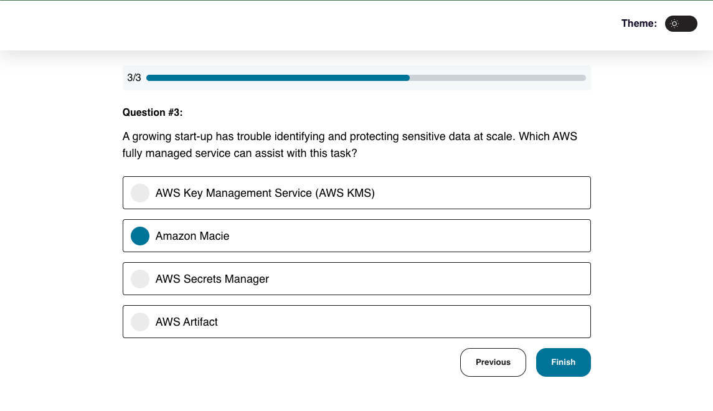
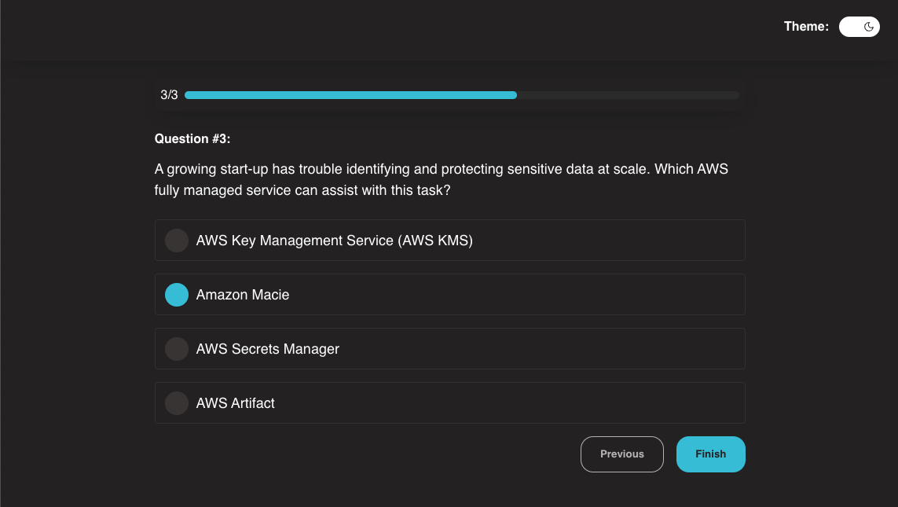

# quizland-react-typescript

QuizLand is quiz frontend application made with React, TypeScript, styled-components and quizland-core library.

The main idea of this open-source project is to share AWS Cloud Practitioner questions to help students prepare for the exam. 

## Light Mode Theme

  

## Dark Mode Theme

  

## Stack

- React 19
- TypeScript 5
- Webpack 5
- Jest
- quizland-core (npm package responsible for dealing with quiz logic)

## 👩 Author

| [ <b>@laisfrigerio</b>](https://github.com/laisfrigerio)  |
| :--------------------------------------------------------------------------------------------------------------------------------------------------------------------------------: |

## 📄 License

This project is licensed under the MIT License - see the LICENSE.md file for details
